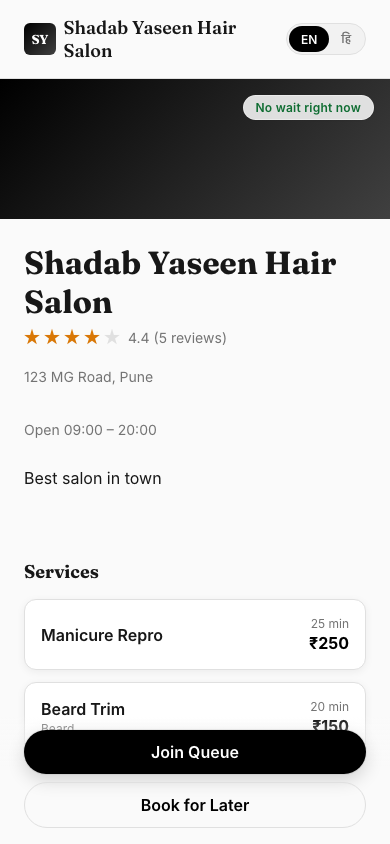
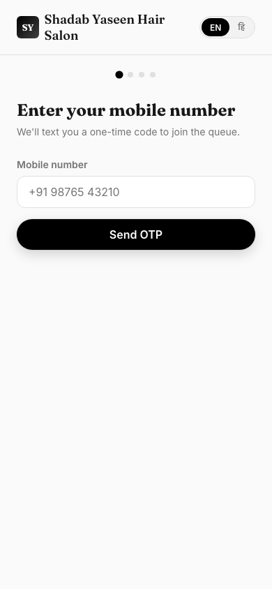
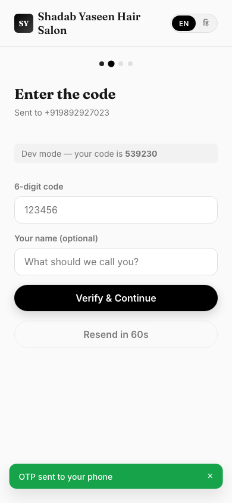
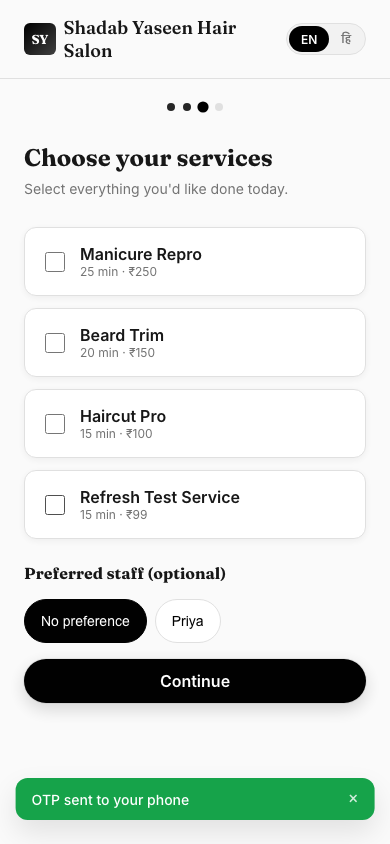
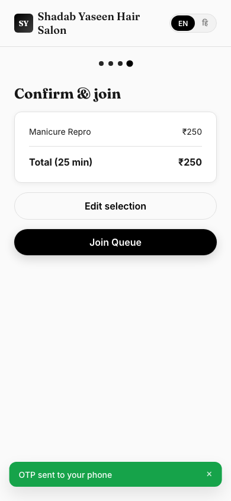
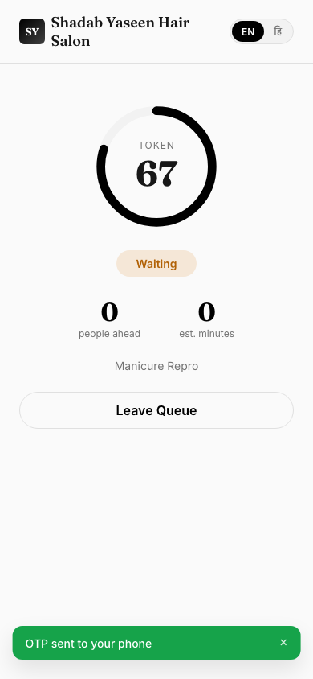
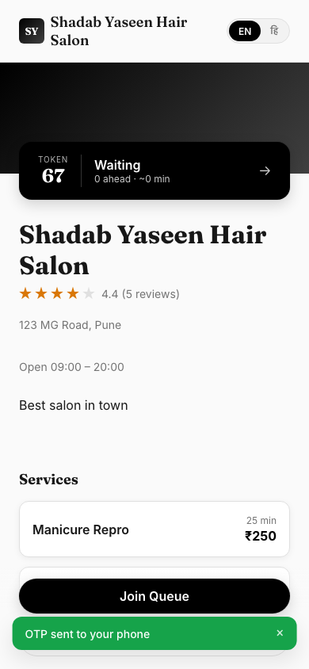
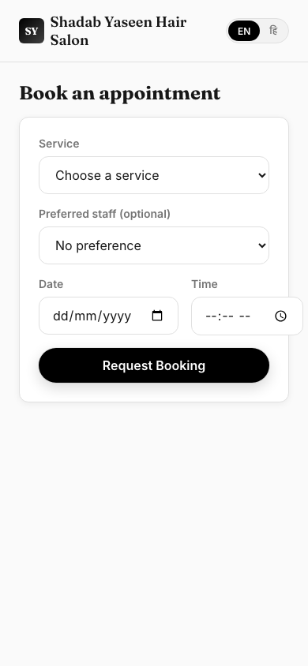
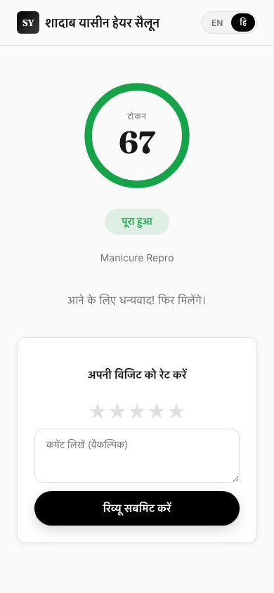
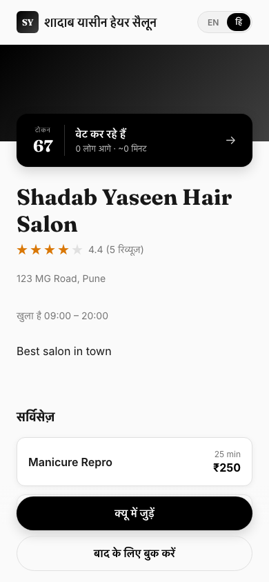

# Customer Guide — Shadab Yaseen Hair Salon App
# ग्राहक गाइड — शादाब यासीन हेयर सैलून ऐप

This guide shows how customers use the app to skip the wait — join the queue remotely, track their position live, or book an appointment for later.

यह गाइड बताती है कि ग्राहक इस ऐप का उपयोग कैसे करें — लाइन में लगे बिना दूर से क्यू में जुड़ें, अपनी बारी लाइव ट्रैक करें, या बाद के लिए अपॉइंटमेंट बुक करें।

---

## 1. Salon page / सैलून पेज

Open the app link — you'll see the salon's info, services, team, and reviews.

ऐप का लिंक खोलें — आपको सैलून की जानकारी, सर्विसेज़, टीम और रिव्यूज़ दिखेंगे।

At the top you'll see how many people are already waiting ("No wait right now" or "X waiting"). Two buttons at the bottom: **Join Queue** (right now) and **Book for Later** (advance booking).

ऊपर दिखेगा कि अभी कितने लोग वेट कर रहे हैं ("No wait right now" या "X waiting")। नीचे दो बटन हैं: **Join Queue** (अभी क्यू में जुड़ें) और **Book for Later** (बाद के लिए बुक करें)।

---

## 2. Joining the queue / क्यू में जुड़ना

Tap **Join Queue**. Enter your mobile number and tap **Send OTP**.

**Join Queue** पर टैप करें। अपना मोबाइल नंबर डालें और **Send OTP** पर टैप करें।

You'll get a 6-digit code by SMS. Enter it, optionally add your name, and tap **Verify & Continue**.

आपको SMS से 6 अंकों का कोड मिलेगा। उसे डालें, चाहें तो अपना नाम भी डालें, और **Verify & Continue** पर टैप करें।

Select the service(s) you want and (optionally) your preferred staff member, then tap **Continue**.

जो सर्विस चाहिए वो चुनें और (चाहें तो) पसंदीदा स्टाफ भी चुनें, फिर **Continue** पर टैप करें।

Review the summary — total price and time — then tap **Join Queue** to confirm.

समरी चेक करें — कुल कीमत और समय — फिर कन्फर्म करने के लिए **Join Queue** पर टैप करें।

---

## 3. Tracking your turn live / अपनी बारी लाइव ट्रैक करना

You'll land on your live tracking page — this updates automatically, no need to refresh. It shows your **token number**, current **status** (Waiting / Up Next / In Service), how many **people are ahead**, and the **estimated wait** (which counts down in real time).

आप अपने लाइव ट्रैकिंग पेज पर पहुंच जाएंगे — यह अपने आप अपडेट होता है, रिफ्रेश करने की जरूरत नहीं। इसमें दिखता है आपका **टोकन नंबर**, मौजूदा **स्टेटस** (Waiting / Up Next / In Service), कितने **लोग आगे** हैं, और **अनुमानित वेट टाइम** (जो real time में कम होता रहता है)।

**When your turn is ~10 minutes away, you'll get an SMS** telling you to head to the salon — so you don't have to keep the app open and stare at the screen.

**जब आपकी बारी ~10 मिनट दूर हो, तब आपको एक SMS मिलेगा** जिसमें कहा जाएगा सैलून पहुंच जाएं — इसलिए ऐप को लगातार खोलकर देखते रहने की जरूरत नहीं है।

If you go back to the home page while still in the queue, your token shows right there too (in a black banner at the top), so you can check anytime without hunting for the link again.

अगर आप क्यू में रहते हुए वापस होम पेज पर जाएं, तो आपका टोकन वहां भी ऊपर एक black banner में दिखेगा — जब चाहें check kar sakte hain, link दोबारा ढूंढने की जरूरत नहीं।

Changed your mind? Tap **Leave Queue** at the bottom of the tracking page.

Irada badal gaya? Tracking page ke bottom mein **Leave Queue** par tap karein.

---

## 4. Booking for later instead / बाद के लिए बुक करना

If you don't want to wait in the live queue, tap **Book for Later** from the home page instead. Choose a service, staff (optional), date and time, then tap **Request Booking**. The salon owner will confirm it.

अगर आप live queue mein wait nahi karna chahte, home page se **Book for Later** par tap karein। Service, staff (optional), date aur time chunein, phir **Request Booking** par tap karein। Salon owner isko confirm karega.

Your bookings (upcoming and past) show at the bottom of this same page, with a **Cancel** option for anything still pending or confirmed.

Aapki bookings (upcoming aur past) isi page ke neeche dikhengi, jismein pending ya confirmed bookings ke liye **Cancel** ka option bhi hoga।

---

## 5. After your visit — leave a review / visit ke baad — review dein

Once the salon marks you as completed, your tracking page shows a thank-you message and a review form (only for you, the customer — nobody else sees it on your screen). Pick a star rating, add a comment if you like, and tap **Submit Review**.

Jab salon aapko completed mark kar de, tracking page par thank-you message aur review form dikhega (sirf aapko, customer ko — kisi aur ko yeh screen par nahi dikhega)। Star rating chunein, chahe toh comment likhein, aur **Submit Review** par tap karein।

---

## 6. Switching language / भाषा बदलना

Tap the **EN / हि** toggle in the top-right corner (or top of the login screen) anytime to switch the whole app between English and Hindi. Your choice is remembered the next time you open the app.

Top-right corner mein (ya login screen ke top par) **EN / हि** toggle kabhi bhi tap karke poori app ko English aur Hindi ke beech switch kar sakte hain। Aapki choice agli baar app kholne par bhi yaad rahegi।

---

## Quick summary / जल्दी में समरी

| Step | English | Hindi |
|---|---|---|
| 1 | Open the salon link | सैलून का link kholein |
| 2 | Tap Join Queue → enter phone → OTP | Join Queue tap karein → phone daalein → OTP |
| 3 | Choose service(s) → confirm | Service chunein → confirm karein |
| 4 | Watch your token/wait time live | Apna token/wait time live dekhein |
| 5 | Get an SMS ~10 min before your turn | Apni bari se ~10 min pehle SMS milega |
| 6 | Leave a review after your visit | Visit ke baad review dein |
