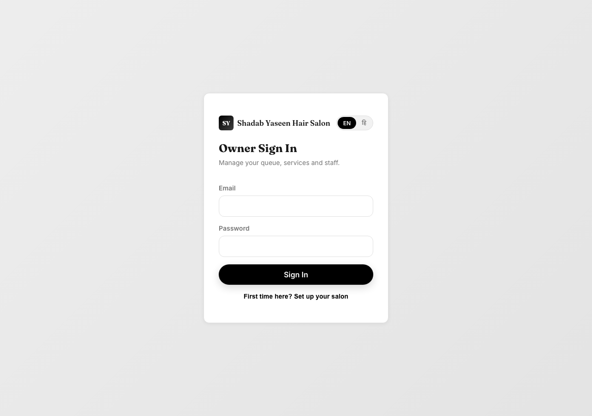
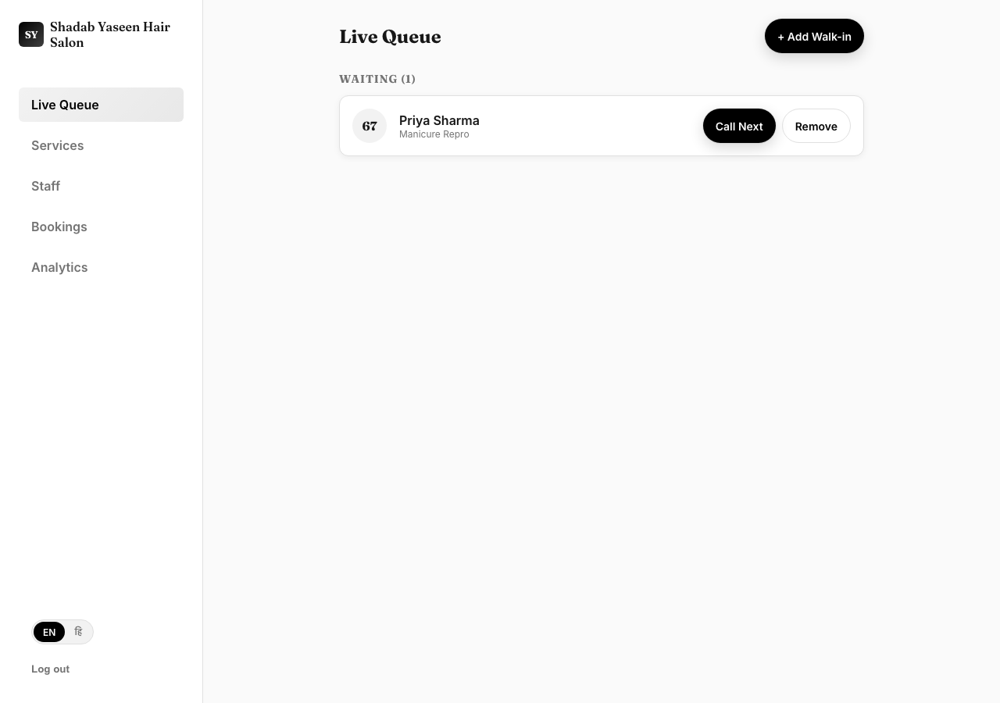
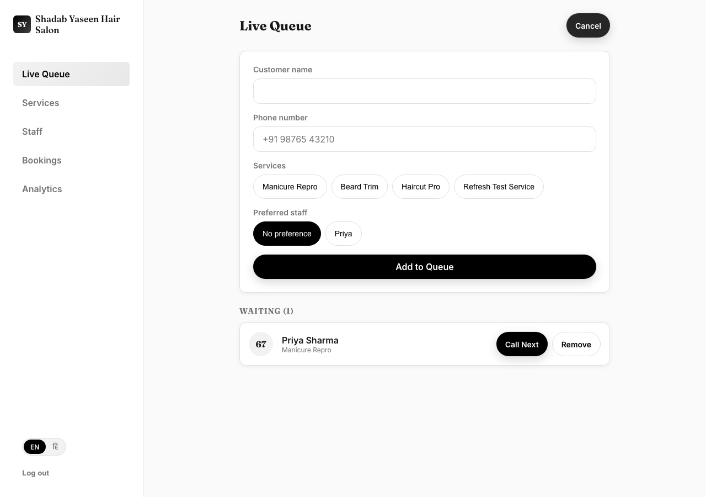
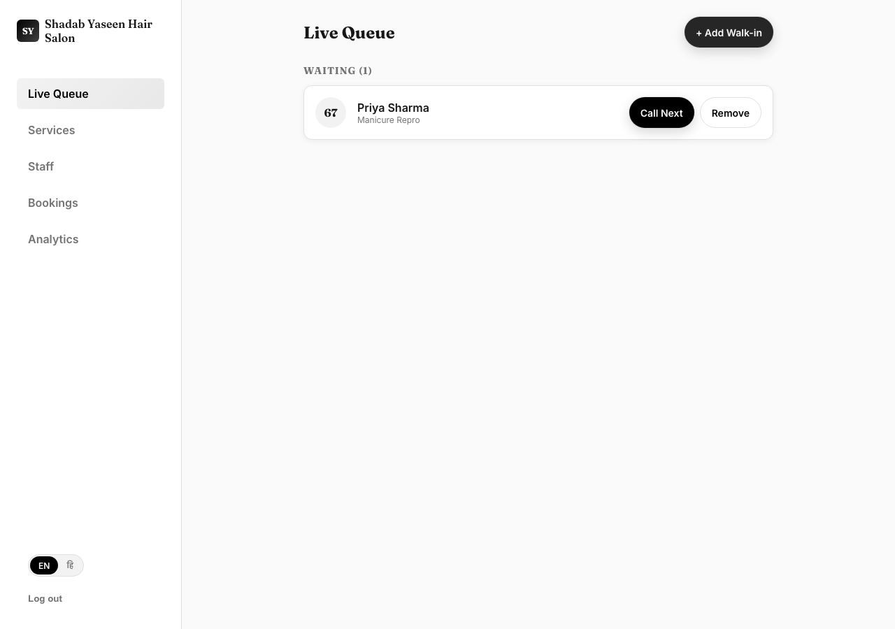
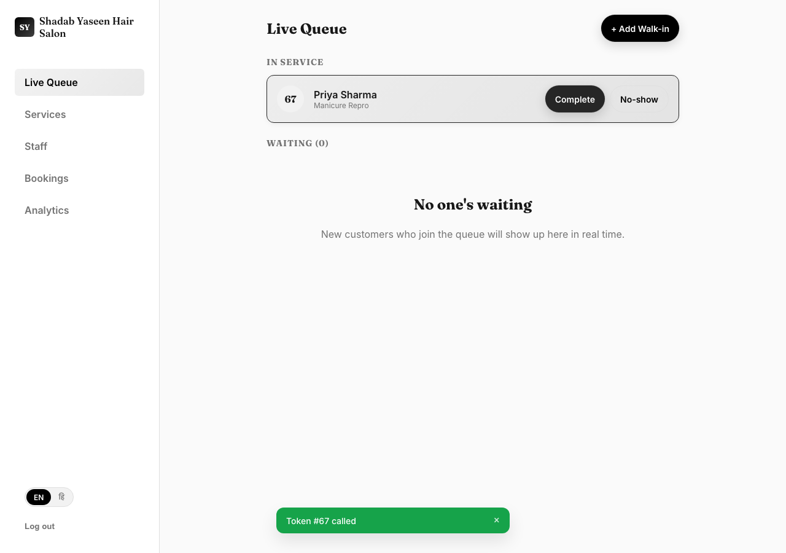
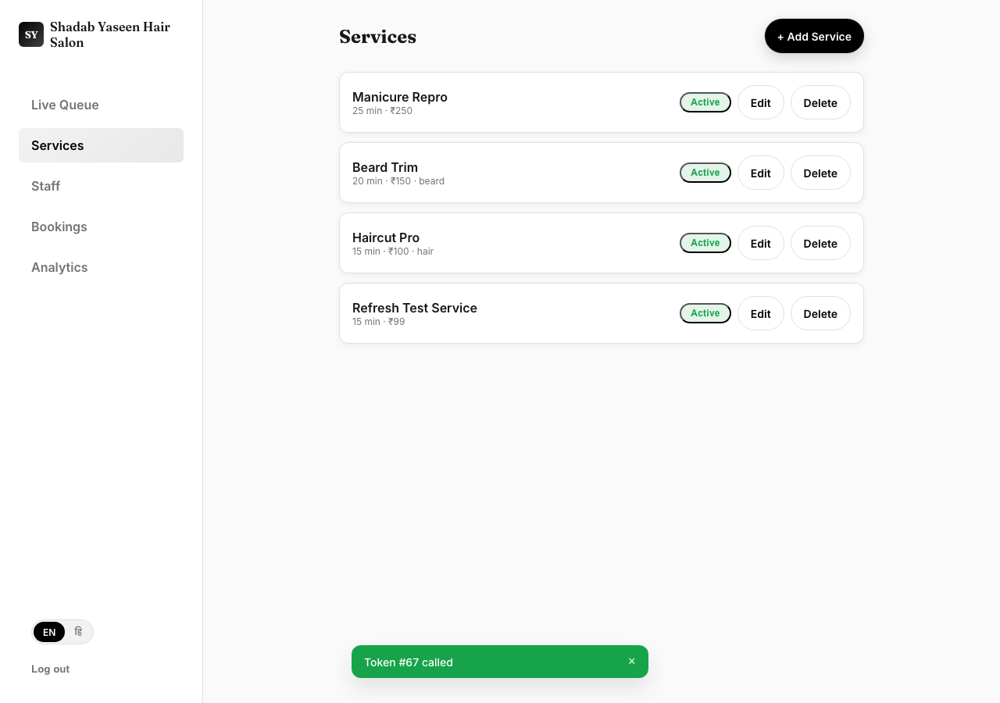
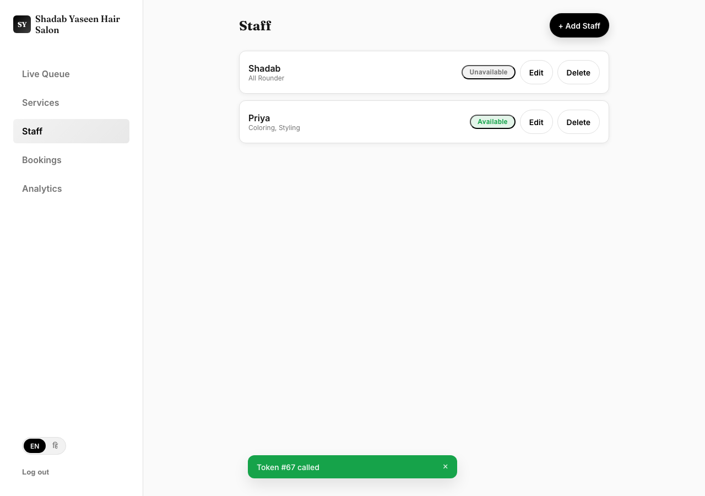
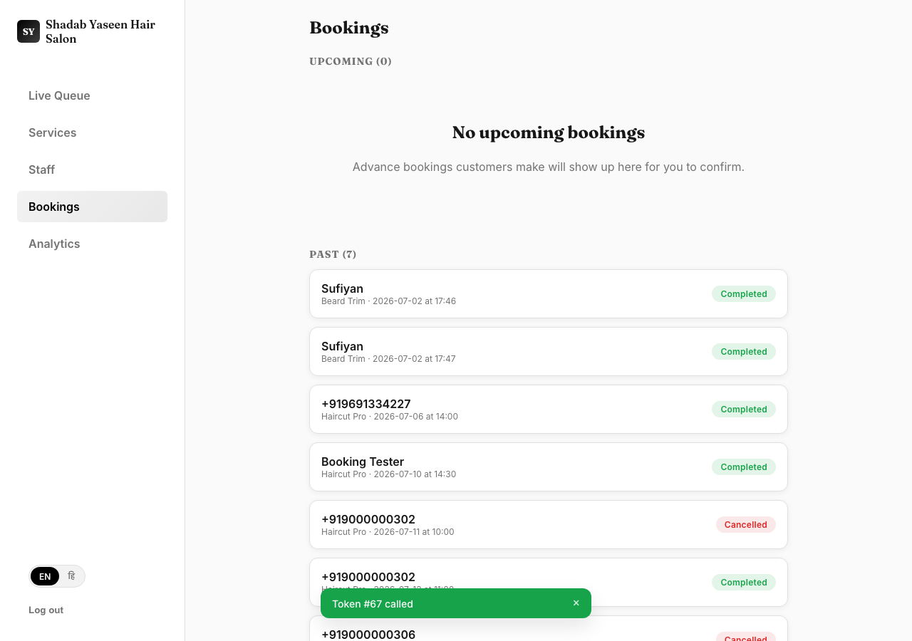
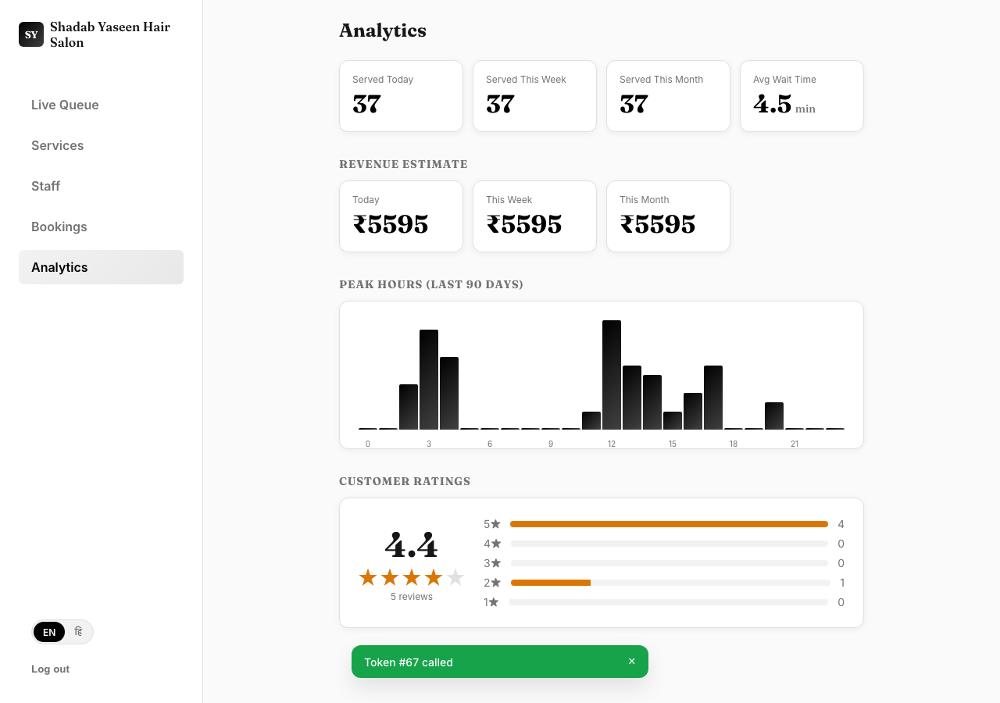
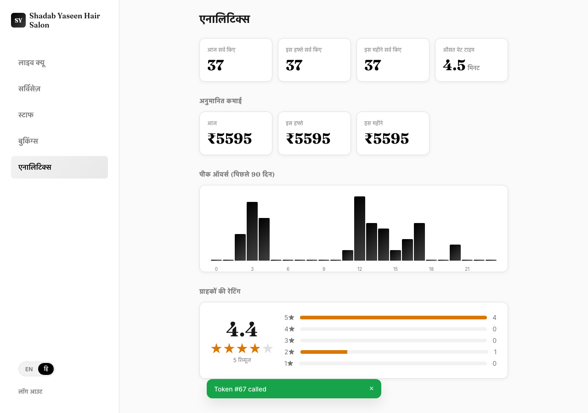

# Owner Guide — Shadab Yaseen Hair Salon App
# ओनर गाइड — शादाब यासीन हेयर सैलून ऐप

This guide shows how to run your salon's daily queue, services, staff, bookings, and see your analytics.

यह गाइड बताती है कि अपने सैलून की रोज़ की queue, services, staff, bookings कैसे manage karein, aur analytics kaise dekhein।

---

## 1. Signing in / साइन इन करना

Go to the owner login page, enter your email and password, and tap **Sign In**. First time setting up? Tap "First time here? Set up your salon" instead.

Owner login page par jaayein, apna email aur password daalein, aur **Sign In** par tap karein। Pehli baar setup kar rahe hain? Iske bajaye "First time here? Set up your salon" par tap karein।

---

## 2. Live Queue — your main screen / लाइव क्यू — आपकी मुख्य स्क्रीन

This is what you'll use all day. It shows everyone currently waiting, in the order they joined.

Yeh woh screen hai jo aap poore din use karenge। Isme sabhi log dikhte hain jo abhi wait kar rahe hain, jis order mein woh jude the।

**Adding a walk-in customer**: if someone walks in without using the app, tap **+ Add Walk-in**, fill their name, phone, and service(s), then tap **Add to Queue**. They'll be added to the same live queue as app customers.

**Walk-in customer add karna**: agar koi bina app use kiye seedha aa jaye, **+ Add Walk-in** par tap karein, unka naam, phone, aur service(s) bharein, phir **Add to Queue** par tap karein। Woh usi live queue mein add ho jayenge jisme app customers hote hain।

**Calling the next customer**: when you're ready for the next person, tap **Call Next** on their card. This moves them to "In Service."

**Agle customer ko bulana**: jab agle customer ke liye ready hon, unke card par **Call Next** tap karein। Isse woh "In Service" mein move ho jayenge।

Once you're done with them, tap **Complete**. If they never showed up, tap **No-show** instead. Either way, they leave the active queue and everyone behind them moves up automatically — in real time, on their phones too.

Unka kaam ho jaane par **Complete** tap karein। Agar woh aaye hi nahi, iske bajaye **No-show** tap karein। Dono cases mein woh active queue se hat jaate hain aur unke peeche wale sab automatically aage badh jaate hain — real time mein, unke phone par bhi।

**Important — you also get notified**: when any waiting customer's turn is about 10 minutes away, you'll see a toast notification right here on this screen (as long as this page is open), so you know who's about to arrive.

**Zaroori baat — aapko bhi pata chal jaata hai**: jab kisi waiting customer ki bari ~10 minute door ho, aapko yahin is screen par ek toast notification dikhega (jab tak yeh page khula hai), taaki aapko pata rahe kaun aane wala hai।

---

## 3. Services — what you offer / सर्विसेज़ — आप क्या ऑफर करते हैं

Add, edit, or deactivate the services customers can choose from. Tap **+ Add Service**, fill in name, price, duration, and (optional) category, then **Add Service**.

Wo services add, edit ya deactivate karein jo customers choose kar sakte hain। **+ Add Service** tap karein, naam, price, duration, aur (optional) category bharein, phir **Add Service** karein।

Tap the **Active/Inactive** pill on any service to quickly toggle whether customers can select it right now (without deleting it).

Kisi bhi service par **Active/Inactive** pill tap karke turant toggle kar sakte hain ki customers abhi usse choose kar sakein ya nahi (delete kiye bina)।

---

## 4. Staff — your team / स्टाफ — आपकी टीम

Add your stylists/staff so customers can pick a preferred person when joining the queue or booking.

Apna stylists/staff add karein taaki customers queue join karte ya booking karte waqt apni pasand ka staff chun sakein।

Same idea as services — **Available/Unavailable** toggles whether they show up as an option right now.

Services jaisa hi idea — **Available/Unavailable** se decide hota hai ki woh abhi option ke roop mein dikhein ya nahi।

---

## 5. Bookings — advance appointments / बुकिंग्स — एडवांस अपॉइंटमेंट्स

Customers who used **Book for Later** show up here as "Pending." Tap **Confirm** to accept a booking, **Complete** once it's done, or **Cancel** if it can't happen.

Jin customers ne **Book for Later** use kiya hai woh yahan "Pending" ke roop mein dikhenge। Booking accept karne ke liye **Confirm**, ho jaane par **Complete**, ya na ho paaye toh **Cancel** tap karein।

---

## 6. Analytics — how your salon is doing / एनालिटिक्स — आपका सैलून कैसा चल रहा है

See how many customers you've served today/this week/this month, your estimated revenue, your busiest hours, and your customer ratings — all in one place.

Dekhein aaj/is hafte/is mahine kitne customers serve kiye, aapki anumanit kamai, sabse busy ghante, aur customer ratings — sab ek hi jagah।

---

## 7. Switching language / भाषा बदलना

Tap the **EN / हि** toggle (bottom of the sidebar on desktop, or in the mobile header) to switch the whole dashboard between English and Hindi.

**EN / हि** toggle tap karein (desktop par sidebar ke neeche, ya mobile header mein) poore dashboard ko English aur Hindi ke beech switch karne ke liye।

---

## Quick summary / जल्दी में समरी

| Screen | What it's for | किसलिए है |
|---|---|---|
| Live Queue | Call next, complete, no-show, add walk-ins | अगला बुलाना, पूरा करना, walk-in जोड़ना |
| Services | Add/edit/deactivate what you offer | अपनी सर्विसेज़ manage करना |
| Staff | Add/edit your team | अपनी टीम manage करना |
| Bookings | Confirm/complete/cancel advance bookings | एडवांस बुकिंग्स manage करना |
| Analytics | See how business is doing | बिज़नेस की परफॉर्मेंस देखना |

**Reminder / याद रखें**: keep the Live Queue page open while you're working — that's how you get the "customer arriving soon" notification and see new customers join in real time.

Kaam karte waqt Live Queue page khula rakhein — isi se "customer arriving soon" notification milta hai aur naye customers real time mein join hote dikhte hain।
